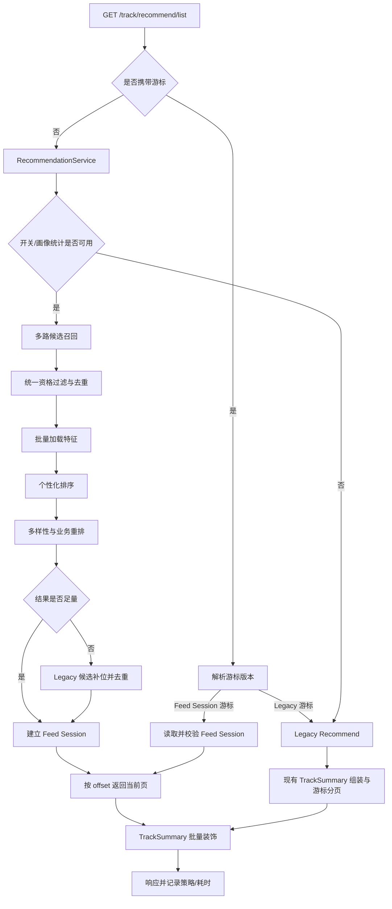

# 推荐轨迹个性化推荐第一版设计方案

> 状态：设计草案，待研发评审，尚未实现。
>
> 面向产品、客户端、服务端、数据和测试协作使用。本文描述第一版推荐系统的目标架构、实现范围和协议草案；当前线上行为仍以 `internal/handler/router.go`、`internal/service/track_service.go`、`internal/repository/*` 和 `docs/api/track.md` 为准。
>
> 本方案不替代现有推荐逻辑。新推荐能力优先执行，现有按时间倒序的推荐逻辑作为补位和最终兜底长期保留。

## 1. 背景

当前推荐接口为：

```text
GET /api/v1/track/recommend/list
```

当前逻辑主要完成：

- 只返回 `status=normal`、`is_running=false` 的公开已完成轨迹；
- 可按非空 `city_code` 精确过滤；
- 过滤没有 `raw_track_url` 的轨迹；
- 按 `start_time DESC, id DESC` 排序和游标分页；
- 填充作者、城市名、收藏状态、收藏数和导航数；
- 在当前分页窗口内将审核通过的精选投稿优先展示；
- 改写轨迹截图和原始轨迹文件为服务端本地缓存地址。

该逻辑稳定、可解释、依赖少，适合作为基础列表和故障兜底，但还不具备真正的个性化推荐能力：

- `user_id` 没有参与候选召回和排序；
- 收藏、导航、关注、详情点击等行为没有形成用户兴趣画像；
- 热度、新鲜度、内容质量没有进入统一排序分；
- 缺少近期曝光去重和结果多样性控制；
- 精选投稿只在当前分页窗口内前置，不是全局统一排序；
- 当前 `start_time + id` 游标无法稳定承载按个性化分数排序的结果；
- 现有埋点缺少推荐请求 ID、候选来源和逐条曝光位置，无法准确归因和评估推荐效果。

## 2. 设计目标

### 2.1 目标

- 保持现有 `/track/recommend/list` 对外入口，客户端无需切换到另一套接口。
- 优先返回个性化推荐结果，在候选不足时使用现有推荐逻辑补位。
- 新推荐链路异常、超时或数据未就绪时，完整降级到现有推荐逻辑。
- 利用现有城市、运动类型、收藏、导航、关注、轨迹完成记录、投稿信息和 RouteGroup 数据。
- 第一版使用可解释的规则召回和规则排序，不引入训练模型。
- 推荐结果支持稳定分页，同一次 Feed 浏览过程中不因实时分数变化而重复或漏项。
- 支持曝光、点击、收藏和导航的转化归因与效果观测。
- MySQL、Mongo 和 in-memory 三种仓储保持能力一致。
- 不引入服务启动和降级分支必须依赖的外部服务；推荐不可用时不能影响基础轨迹列表可用性。

### 2.2 非目标

第一版不做：

- 深度学习双塔、Transformer 或端到端神经网络推荐；
- 必须依赖 Redis、Elasticsearch、向量数据库或独立推荐平台；
- 毫秒级实时模型训练；
- 基于原始 GPS 点的在线相似度计算；
- 使用大语言模型生成推荐分数；
- 为匿名未登录用户维护跨设备长期画像；
- 因推荐系统故障阻断 `/track/recommend/list`。

## 3. 核心设计原则

### 3.1 同一接口，内部双链路

客户端继续调用现有接口。服务端内部新增推荐编排层：

```text
新推荐引擎优先
  → 候选不足时由现有推荐补位
  → 硬故障时完整降级到现有推荐
```

不建议长期维护 `/track/recommend/list` 和 `/track/recommend/v2/list` 两套对外协议。统一入口更容易通过配置开关启用、回滚并保持客户端协议稳定。

### 3.2 城市过滤是硬约束

- 非空 `city_code` 必须贯穿所有召回源、补位和兜底查询。
- 不能为了凑满一页混入其他城市。
- 空 `city_code` 才允许全城市召回。
- 未知 `city_code` 可以返回空列表，不视为接口错误。

### 3.3 推荐只处理公开合格内容

所有召回源统一应用以下资格过滤：

- `status=normal`；
- `is_running=false`；
- `raw_track_url` 非空；
- 轨迹未删除、未转私密；
- 默认排除当前用户自己的轨迹；
- Feed Session 建立后轨迹若失效，读取时仍需二次校验。

### 3.4 可解释、可降级、可观测

每次推荐需要知道：

- 使用了哪种策略；
- 使用了哪些召回和排序规则；
- 每条轨迹来自哪个召回源；
- 是否发生补位或降级；
- 降级原因和各阶段耗时。

### 3.5 分页期间不切换策略

第一页采用的有序结果应在后续分页中保持稳定。不能第一页使用个性化推荐，第二页因临时故障切换为时间流，否则会产生重复、漏项和排序跳变。

## 4. 术语

| 术语 | 含义 |
| --- | --- |
| Legacy Recommend | 当前按城市过滤并按 `start_time DESC, id DESC` 返回的推荐逻辑 |
| Personalized Recommend | 新的多路召回、个性化排序和多样性重排链路 |
| Hybrid Result | 新推荐结果不足时，使用 Legacy Recommend 补齐后的结果 |
| Candidate Source | 候选来源，例如内容偏好、城市热门、优质内容、关注作者或探索 |
| Feed Session | 固化一次推荐请求的有序 Track ID 列表，供稳定分页使用 |
| Request ID | 一次 Feed Session 的唯一标识，用于分页、埋点和问题追踪 |
| Strategy | `personalized`、`hybrid` 或 `legacy` |

## 5. 总体架构



建议新增的内部组件：

- `RecommendationService`：推荐入口和降级编排；
- `CandidateGenerator`：各召回源统一接口；
- `RecommendationFeatureLoader`：批量加载用户、轨迹和上下文特征；
- `RecommendationRanker`：第一版规则排序；
- `RecommendationReranker`：多样性、频控和探索控制；
- `RecommendationRepository`：画像、内容统计和 Feed Session 存储；
- `LegacyRecommendAdapter`：封装当前推荐逻辑，供补位和兜底复用；
- 离线构建任务：画像更新、统计聚合和过期 Session 清理。

## 6. 请求处理流程

### 6.1 首次请求

首次请求不携带 `cursor`：

1. 校验用户身份、`city_code` 和 `limit`。
2. 检查推荐开关、用户画像、内容统计新鲜度和熔断状态。
3. 不满足启用条件时直接进入 Legacy Recommend。
4. 并行执行多个候选召回源。
5. 合并候选并按 Track ID、RouteGroup 去重。
6. 应用公开性、城市、本人轨迹、近期曝光等过滤。
7. 批量加载用户特征、内容特征和上下文特征。
8. 计算统一推荐分数。
9. 执行作者、RouteGroup、运动类型多样性和探索重排。
10. 若结果不足，从 Legacy Recommend 获取候选并排除重复项后补齐。
11. 将最终 Top N 有序 Track ID 固化为 Feed Session。
12. 返回第一页，同时生成包含 `request_id + offset` 的新游标。
13. 记录策略、召回数、过滤数、补位数和耗时。

首次固定固化 200 条有序结果；候选不足时按实际结果数量保存，不为凑满 200 条放宽城市和内容资格约束。

### 6.2 后续分页

新推荐游标建议包含：

```json
{
  "version": 2,
  "request_id": "rec_01J...",
  "offset": 20
}
```

服务端收到后：

1. 解码并校验版本、offset 范围和 request ID 格式。
2. 根据 request ID 读取 Feed Session。
3. 校验 Session 属于当前用户；后续页未传 `city_code` 时使用 Session 中的城市，显式传入非空 `city_code` 时必须与 Session 一致。
4. 校验 Session 未过期；Feed Session TTL 固定为 60 分钟。
5. 从游标 offset 开始向后分批扫描固化 Track ID，批量读取 Track 并再次校验公开性、状态和账号限制；失效内容直接跳过，不重新召回和打分。
6. 持续向后扫描，直到收集到 `limit` 条仍可见内容或固化列表耗尽；`recommend_rank` 始终使用 Track 在原始 Session 有序列表中的位置，因此被跳过的失效内容会造成排名跳号，客户端必须原样使用服务端排名。
7. 如果已收集满一页，继续探测后续是否至少还有一条可见内容；`next_cursor.offset` 指向下一条尚未返回的可见候选位置。若后续无可见内容，则 `has_more=false` 且不返回下一页游标。
8. 返回当前页；不允许出现 `items=[]` 但 `has_more=true`，固化列表已耗尽或剩余内容全部失效时必须返回 `items=[]`、`has_more=false`。

后续分页不重新召回和打分。内容失效只影响实际返回条数和原始排名是否连续，不改变剩余内容的相对顺序，也不使用新内容临时补位。

### 6.3 首发客户端与游标迁移

游标必须带版本并保持不透明。第一版按产品首发统一升级，不增加客户端能力头或版本协商：

- 服务端能识别 `version=2` 的 Feed Session 游标；
- 对原有只包含 `start_time + id` 的游标继续走 Legacy Recommend，用于服务端迁移和降级，但这不构成旧客户端兼容承诺；
- 推荐功能只对完整支持新响应字段、Feed Session 游标、`recommend_cursor_expired` 错误处理和推荐上下文归因的首发客户端开放；
- 服务端可以提前部署，但正式环境必须保持 `RECOMMENDATION_ENABLED=false`，直到首发客户端联调和验收通过后再整体开启；
- 旧内部测试包不纳入兼容和验收范围，推荐开关开启后不保证其分页、过期恢复和推荐归因行为正常；
- 新 Feed Session 过期后返回明确的“推荐游标已过期”业务错误。客户端收到后丢弃旧游标，保持当前 `city_code` 和筛选条件，静默发起一次不带 `cursor` 的第一页请求；只允许自动重试一次，刷新仍失败时再展示通用重试状态，禁止循环刷新。

如果 Feed Session 仓储本身故障，第一页可直接返回完整 Legacy Recommend 响应及旧游标，最大化接口可用性。

Feed Session 过期或被清理只终止后续分页，不撤销已经下发的推荐归因上下文。静默刷新成功后，新 Feed 必须使用新的 `request_id`；过期前已进入客户端本地队列的历史事件，以及从旧 Feed 打开的详情页后续产生的收藏、取消收藏、导航和分享事件，仍保留原 `request_id`、候选来源和排名。客户端不得在补发或转化发生时把历史上下文替换成新 Feed 的上下文。

## 7. 多路候选召回

第一版建议每次召回约 250～350 条，再统一排序。初始配额可配置：

| 召回源 | 初始配额 | 说明 |
| --- | ---: | --- |
| 用户内容偏好 | 100 | 根据运动类型、城市、距离、时长、爬升等画像匹配 |
| 城市近期热门 | 80 | 最近 7/30 天收藏、导航、点击的时间衰减热度 |
| 关注作者 | 40 | 用户关注作者发布的合格轨迹 |
| 优质内容 | 40 | 审核通过、资料完整或 RouteGroup 代表轨迹 |
| 新内容探索 | 40 | 新轨迹、低曝光优质轨迹和少量随机探索 |

配额不是最终展示比例。候选合并后还需要过滤、排序和重排。

### 7.1 用户内容偏好召回

根据用户历史行为聚合：

- 运动类型偏好；
- 常浏览或使用的城市；
- 距离区间偏好；
- 时长区间偏好；
- 爬升区间偏好；
- 投稿难度、风险、路面和适宜月份偏好；
- 常互动的 RouteGroup；
- 常互动的作者。

结构化特征优先，第一版不引入文本 embedding。

### 7.2 城市近期热门召回

热度需要加入时间窗口和衰减，不能直接使用历史总收藏数：

```text
popularity =
    log1p(近 30 天收藏数 × 3
        + 近 30 天导航数 × 5
        + 近 30 天详情点击数)
    × 时间衰减
```

为避免低曝光内容 CTR 抖动，点击率应使用贝叶斯平滑或最小曝光门槛。

第一版以业务数据库中的收藏、导航等服务端权威行为为主；曝光和点击统计尚未形成稳定聚合产物时可以不参与在线排序，不能因此阻断推荐链路。

### 7.3 关注作者召回

- 召回当前用户所关注作者的公开合格轨迹；
- 作者关系是加分项，不应占满整页；
- 同一作者需要设置页内上限；
- 作者最新轨迹和用户历史偏好同时满足时可以获得更高分。

### 7.4 优质内容召回

- 召回审核通过且当前有效的投稿；
- 召回资料完整、截图可用的 RouteGroup 代表轨迹；
- 优质内容只获得有限加分和固定候选配额，不能覆盖用户兴趣；
- 同一 RouteGroup 只保留一个展示候选。

### 7.5 新内容探索召回

探索用于避免热门内容永久垄断流量：

- 新发布且资料完整的轨迹；
- 已审核通过但曝光较少的投稿；
- 同城低曝光 RouteGroup；
- 与用户主要偏好相邻但不完全相同的运动类型或距离区间。

建议探索内容占最终结果的 10%～15%，通过稳定随机种子避免每次刷新完全变化。

## 8. 用户行为和特征

### 8.1 行为强度

初始权重建议：

| 行为 | 初始权重 | 数据性质 |
| --- | ---: | --- |
| 一次导航正常结束并成功上报 | 5 | 强正反馈，业务数据库 `track_navigations` 权威 |
| 收藏 | 4 | 强正反馈，业务数据库权威 |
| 分享 | 2 | 中等正反馈，客户端埋点 |
| 完成同类型轨迹 | 2 | 兴趣信号，业务数据库权威 |
| 轨迹详情曝光 | 1 | 弱正反馈，客户端埋点 |
| 推荐卡片点击 | 0.5～1 | 弱正反馈，客户端埋点 |
| 取消收藏 | -3 | 负反馈，需要保留历史事件或埋点 |
| 多次曝光未点击 | -0.1～-0.3 | 极弱负反馈，必须设置次数和时间门槛 |

这些权重只是首版参数，不是长期业务常量。所有历史行为应乘时间衰减，例如 30 天半衰期。

“没有点击”不能直接视为强负反馈，因为用户可能没有看到卡片或没有浏览到该位置。

第一版按数据权威性和时效拆分行为来源：

- 收藏、导航、关注等强行为直接从业务数据库聚合，不依赖埋点数据仓库；其中导航只认客户端在一次导航正常结束后成功写入 `track_navigations` 的记录，点击导航或仅成功进入导航页不计导航强反馈；
- 推荐曝光、卡片点击和详情浏览等弱行为来自客户端埋点，按 T+1、24 小时级可用设计；
- 弱行为尚未到达或批次失败时，只使用业务数据库中的强行为和上一批可用统计，不能阻断在线推荐；
- 用户画像和内容统计必须记录数据截止时间，避免把 T+1 数据误认为实时数据。

### 8.2 用户特征

- 不同 `track_type` 的兴趣分布；
- 城市兴趣分布；
- 距离、时长、爬升分桶偏好；
- 投稿难度、风险和路面偏好；
- RouteGroup 兴趣；
- 作者亲和度；
- 最近交互和最近曝光集合；
- 用户活跃程度和画像置信度。

### 8.3 内容特征

- `city_code`；
- `track_type`；
- 距离、时长、爬升分桶；
- 创建时间和新鲜度；
- 近 7/30 天收藏、导航、详情和点击统计；
- 是否为有效审核投稿；
- 投稿难度、风险、月份、路面类型；
- RouteGroup 及组内质量信息；
- 作者及作者关注关系；
- 内容完整度，例如标题、截图、投稿图片和结构化资料。

### 8.4 上下文特征

- 请求 `city_code`；
- 当前月份和季节；
- 客户端平台、版本和语言；
- Feed 中的位置；
- 本次是否为首次请求或继续翻页；
- 推荐策略。

不得使用原始精确经纬度作为推荐计算或埋点字段；位置只使用城市或经过隐私处理的粗粒度区域。

## 9. 第一版规则排序

第一版使用线性规则分，便于解释、调试和快速上线：

```text
score =
    0.35 × 用户内容偏好
  + 0.20 × 时间衰减热度
  + 0.15 × 作者亲和度
  + 0.15 × 内容完整度和投稿质量
  + 0.10 × 新鲜度
  + 0.05 × 探索分
  - 近期曝光惩罚
  - 已收藏/已导航轨迹的重复推荐惩罚
```

要求：

- 各特征先归一化到稳定区间；
- 精选投稿作为质量特征加分，不再在分页后无条件置顶；
- 热度使用 `log1p`、时间衰减和 CTR 平滑，避免头部内容无限放大；
- 分数相同时使用稳定的 Track ID 作为最终排序键；
- 规则权重通过配置集中管理，上线前使用固定测试样本完成回放和调参。

## 10. 多样性和业务重排

排序后需要执行以下约束：

- 同一 RouteGroup 每页最多展示 1 条；
- 同一作者每页默认最多展示 2 条；
- 同一运动类型连续展示数量设置上限；
- 已收藏或已导航轨迹不强制排除，但对同一 Track 施加强重复推荐惩罚，使其通常排在未互动内容之后；收藏和导航行为仍作为用户运动类型、城市、RouteGroup 和作者偏好的强正反馈，候选不足时允许再次出现；
- 近 7 天已多次曝光但无互动的轨迹明显降权；
- 保留 10%～15% 探索位；
- 运营质量加分必须设置上限，不能完全覆盖用户偏好；
- Legacy 补位候选也必须经过 Track ID 和 RouteGroup 去重。

第一版只使用确定性的页内配额和去重规则，不引入额外的相似度重排算法。

## 11. 冷启动策略

### 11.1 新用户

新用户没有足够行为时：

1. 指定城市近期热门；
2. 当前月份适宜路线；
3. 审核通过且资料完整的优质投稿；
4. 新内容探索；
5. Legacy Recommend 补位。

如果客户端以后增加运动偏好选择，可直接作为冷启动画像，不需要等待行为积累。

### 11.2 新内容

新 Track 没有收藏和导航时，依赖：

- 内容特征匹配；
- 所属 RouteGroup；
- 投稿质量；
- 新鲜度；
- 探索配额。

不能因为历史行为为零而永久没有曝光。

### 11.3 画像置信度

用户有效正反馈少于一定门槛时，提高热门、优质内容和探索权重；行为充分后再逐步提高内容偏好和作者亲和度权重，避免稀疏画像产生过度拟合。

## 12. 兜底和故障处理

### 12.1 兜底层级

```text
已有 Feed Session
  → Personalized Recommend
  → Hybrid：个性化结果 + Legacy 补位
  → Legacy Recommend
```

### 12.2 完整降级条件

以下情况首次请求直接进入 Legacy Recommend：

- `RECOMMENDATION_ENABLED=false`；
- 内容统计尚未就绪；用户画像缺失按第 11 节冷启动策略处理，不属于异常；
- 画像或统计数据超过最大允许年龄；
- 推荐仓储不可用；
- 任一关键阶段超出推荐计算超时；
- 熔断器处于打开状态；
- 推荐引擎发生未预期错误；
- 新推荐经过过滤后完全没有候选。

当推荐总开关已开启且 Feed Session 仓储可用时，上述降级产生的 Legacy 候选仍应固化为 `strategy=legacy` 的 Feed Session，并返回完整推荐归因字段。只有总开关关闭、Feed Session 仓储不可用或推荐编排层无法生成归因元数据时，才返回完全保持当前协议的兼容 Legacy 响应。

### 12.3 部分补位

新推荐链路正常但结果不足时：

1. 调用 Legacy Recommend 获取额外候选；
2. 使用相同 `city_code`；
3. 排除已入选 Track、本人 Track 和重复 RouteGroup；
4. 对补位候选继续应用作者频控、内容可见性和页内多样性约束；
5. 将合格补位内容追加到重排结果；
6. Strategy 记录为 `hybrid`；
7. 记录个性化数量和补位数量。

### 12.4 超时和熔断

推荐计算应设置独立超时，例如 200～300 ms，不包含后续 OSS 资源缓存耗时。连续失败达到阈值后短时间熔断，直接走 Legacy Recommend，避免每个请求重复等待超时。

### 12.5 降级实现约束

- Legacy Recommend 逻辑必须保持独立、可直接调用，不能依赖新的推荐画像、统计数据或外部服务；
- MySQL/Mongo 初始化失败后使用 in-memory 仓储时，至少仍能执行 Legacy Recommend；
- 新增 RecommendationRepository 时，MySQL、Mongo 和 in-memory 三种实现必须同步；
- 推荐离线任务失败不能影响 HTTP 服务启动；
- 不能在降级分支里调用必须在线的外部推荐服务。

### 12.6 已有 Session 分页故障

已有 v2 Feed Session 的后续分页必须区分“Session 已过期/不存在”和“Session 仓储暂时不可用”：

- Session 已过期或确定不存在：返回 `400 Bad Request` 和 `error_code=recommend_cursor_expired`，客户端按第 6.3 节静默刷新第一页；
- Session 仓储连接失败、超时或暂时不可用：返回 `503 Service Unavailable` 和 `error_code=recommend_session_unavailable`；
- `recommend_session_unavailable` 时服务端不得中途改走 Legacy Recommend，也不得创建新 Feed，否则会破坏已浏览列表的顺序和归因；
- 客户端保留当前页面、原游标和原推荐上下文，可对同一游标做有限退避重试或展示点击重试入口，但不得把该错误当作过期并静默刷新第一页。

无 cursor 的第一页请求仍可按第 12.2 节完整降级，因为此时尚未向客户端承诺某个 Feed Session 的稳定顺序。

## 13. 数据结构草案

以下为第一版所需数据结构，正式实现时再确定 SQL 长度、索引和清理策略。

### 13.1 Feed Session

`recommend_feed_sessions`：

| 字段 | 说明 |
| --- | --- |
| `request_id` | 主键，随机不可猜测 ID |
| `user_id` | Session 所属用户 |
| `city_code` | 本次硬过滤城市，可为空 |
| `strategy` | `personalized` / `hybrid` / `legacy` |
| `track_ids_json` | 最终有序 Track ID 列表 |
| `sources_json` | 每个 Track 的候选来源和原因 |
| `created_at` | 创建时间 |
| `expires_at` | 过期时间，固定为创建后 60 分钟 |

`track_ids_json` 与 `sources_json` 必须按位置一一对应；后续分页直接使用 Session 中固化的主要候选来源，并根据列表 offset 计算 `recommend_rank`，不能重新召回或重新判定 `candidate_source`。

读取 Session 时必须校验 `user_id`，不能仅凭 request ID 返回其他用户的推荐列表。

第一版直接使用 MySQL/Mongo/in-memory 三种实现，不引入新的外部缓存依赖。

### 13.2 用户画像

`recommend_user_profiles`：

| 字段 | 说明 |
| --- | --- |
| `user_id` | 用户 ID |
| `profile_json` | 运动类型、城市、距离、时长、RouteGroup 和作者偏好 |
| `positive_event_count` | 有效正反馈数量 |
| `data_through_at` | 本批画像实际包含的行为数据截止时间，用于判断 T+1 新鲜度 |
| `generated_at` | 生成时间 |
| `updated_at` | 更新时间 |

画像是可重建派生数据，不是收藏、导航等行为的权威来源。

### 13.3 内容统计

`recommend_item_stats_daily` 可保存按天聚合的收藏、导航，以及 T+1 可用的曝光、点击和详情浏览统计；每个批次必须记录 `event_date`、`data_through_at` 和 `generated_at`。原始埋点仍归档到 OSS，不把全量原始事件写入业务 MySQL。第一版的收藏、导航和关注关系直接来源于业务权威表；曝光、点击和详情浏览聚合不可用时使用上一批可用值或零值，并降级为以强行为为主的热度和画像。推荐原始事件保留 180 天，过期后依赖日聚合数据继续提供趋势和画像输入。

## 14. Repository 和服务接口草案

建议新增独立 `RecommendationRepository`，不要继续膨胀 `TrackRepository`：

```go
type RecommendationRepository interface {
    GetUserProfile(ctx context.Context, userID int64) (*RecommendationUserProfile, error)
    SaveUserProfile(ctx context.Context, profile *RecommendationUserProfile) error
    ListItemStats(ctx context.Context, trackIDs []string, from, to time.Time) (map[string]*RecommendationItemStats, error)
    SaveItemStats(ctx context.Context, stats []*RecommendationItemStats) error
    SaveFeedSession(ctx context.Context, session *RecommendationFeedSession) error
    GetFeedSession(ctx context.Context, requestID string) (*RecommendationFeedSession, error)
    DeleteExpiredFeedSessions(ctx context.Context, before time.Time, limit int) (int64, error)
}
```

轨迹仓储需要补充批量能力：

- 批量按 ID 读取 Track，并按输入 ID 顺序恢复排序；
- 按内容条件批量召回候选；
- 批量读取 Track 与 RouteGroup 的关联；
- 批量读取指定窗口的收藏、导航和关注行为；
- 避免对数百个候选逐条调用 `FindByID`。

`TrackSummary` 的作者、收藏、导航、投稿和资源地址装饰逻辑应抽取成可复用批处理，Legacy 和 Personalized 两条链路共享同一输出口径。

## 15. API 协议草案

路径和现有请求参数保持不变：

```http
GET /api/v1/track/recommend/list?city_code=330100&limit=20&cursor=<opaque_cursor>
```

建议在 `data` 中增加推荐元信息。支持推荐新协议的首发客户端必须正确消费这些字段；推荐开关启用后，不再以旧内部测试包“忽略新增字段仍可使用”作为兼容目标：

```json
{
  "code": 0,
  "data": {
    "items": [
      {
        "id": "NO.00001234",
        "title": "西湖徒步",
        "recommend_rank": 1,
        "candidate_source": "content_affinity",
        "recommend_reason": "你常看徒步路线"
      }
    ],
    "next_cursor": "opaque-v2-cursor",
    "has_more": true,
    "recommendation": {
      "request_id": "rec_01J...",
      "strategy": "hybrid"
    }
  }
}
```

`request_id` 和 `strategy` 必须返回，用于曝光、点击、收藏和导航归因。

新协议下的成功响应即使 `items=[]`，也必须返回 `recommendation.request_id`、`recommendation.strategy`、`has_more=false` 和空 `next_cursor`，让客户端能够按统一上下文上报空结果页曝光。

单个 item 在现有 `TrackSummary` 基础上必须增加：

- `recommend_rank`：Track 在整个 Feed Session 原始有序列表中从 1 开始的全局位置；正常分页继续递增，前序内容失效被过滤时允许跳号；
- `candidate_source`：主要候选来源，取值见第 16 节；
- `recommend_reason`：面向用户展示的简短推荐理由，例如“你常看徒步路线”“杭州近期热门”；

`recommend_reason` 由服务端根据主要候选来源和可公开业务特征生成，客户端直接展示，不自行拼接或推断。原因文案不能暴露内部原始分数、画像明细或风控特征；同一个 Feed Session 后续分页必须使用 Session 中固化的原因，不能重新生成导致文案变化。

第一版建议模板：

| `candidate_source` | 中文示例 |
| --- | --- |
| `content_affinity` | 你常看徒步路线 |
| `city_hot` | 杭州近期热门 |
| `followed_author` | 你关注的用户发布 |
| `quality` | 资料完整的优质路线 |
| `exploration` | 发现一条新路线 |
| `legacy_fill` | 更多路线推荐 |
| `legacy` | 推荐路线 |

服务端根据 `X-Client-Language` 返回对应语言文案，暂不支持的语言回退中文；轨迹类型名称使用 `/track/types` 的展示名，城市名称使用服务端内置城市映射。

推荐编排层正常返回 Legacy 结果时，也必须生成 `request_id`、标记 `strategy=legacy`，并为 item 返回 `recommend_rank` 和 `candidate_source=legacy`，确保降级链路具备同样的曝光归因能力。Hybrid 中由现有逻辑补位的 item 使用 `candidate_source=legacy_fill`。

仅无 cursor 的第一页请求在 Feed Session 或推荐归因元数据本身不可用时，才允许返回当前不含推荐字段的兼容 Legacy 响应和旧游标。客户端遇到这种响应时继续上报原有通用事件，但不得自行生成 `request_id`、策略、候选来源或全局排名；服务端需要监控此类无归因硬降级比例。已有 v2 Feed Session 的后续分页不适用该硬降级，必须按 `recommend_session_unavailable` 返回错误。

Feed Session 过期时返回 `400 Bad Request` 和稳定机器码，客户端不得依赖中文错误文案判断：

```json
{
  "error": "recommend cursor expired",
  "error_code": "recommend_cursor_expired"
}
```

客户端收到 `recommend_cursor_expired` 后保留当前城市和筛选条件，移除 `cursor` 静默刷新第一页；一次用户翻页操作最多自动重试一次，防止服务端持续异常时形成请求循环。

已有 Session 分页时，如果 Session 仓储暂时不可用，返回 `503 Service Unavailable` 和另一个稳定机器码：

```json
{
  "error": "recommend session unavailable",
  "error_code": "recommend_session_unavailable"
}
```

客户端收到 `recommend_session_unavailable` 后保留当前列表和原游标，允许使用同一游标退避重试或由用户点击重试；不得静默刷新第一页，也不得在客户端切换为 Legacy 时间流。

## 16. 推荐埋点和归因

现有事件需要补充推荐公共属性：

| 字段 | 说明 |
| --- | --- |
| `recommend_request_id` | Feed Session/request ID |
| `recommend_strategy` | personalized / hybrid / legacy |
| `candidate_source` | 主要召回来源：`content_affinity` / `city_hot` / `followed_author` / `quality` / `exploration` / `legacy_fill` / `legacy` |
| `rank_index` | 当前 Track 在整个 Feed Session 中从 1 开始的全局位置，对应响应 item 的 `recommend_rank` |
| `city_code` | 本次推荐请求使用的城市；未限定城市时为空字符串 |

建议事件：

- `track_recommend_view`：页面级曝光；
- `track_recommend_impression`：单条卡片真正进入可视区域时上报；
- `track_card_click`：点击卡片；
- `track_detail_view`：详情页曝光；
- `track_collect_success`：收藏成功；
- `track_uncollect_success`：取消收藏；
- `track_navigation_report_success`：一次导航正常结束后，非幂等导航业务上报接口明确返回 200；该埋点用于链路观测，推荐导航强反馈仍以业务表 `track_navigations` 为权威；
- `track_share_click`：分享点击。

客户端实现和验收以《轨迹 App 埋点方案》的推荐归因属性、曝光条件和上下文传递规则为准：只有 App 位于前台、推荐页实际可见，并且卡片可见面积达到 50% 且连续持续至少 500 ms 才上报曝光；离屏、切页、被其他页面覆盖或 App 进入后台都要取消本次计时，恢复后重新连续计时。同一 `recommend_request_id + track_id` 在整个 Feed Session 中最多上报一次，页面重建或从详情返回不能重置去重状态。

推荐接口成功且推荐页实际展示时，即使 `items=[]` 也要上报一次 `track_recommend_view`，并携带 `result_count=0`、`is_empty=true`；接口失败不报页面成功曝光，改报 `api_request_fail`。点击进入详情后，详情、收藏、取消收藏、导航和分享事件继续携带打开该详情页时的推荐上下文；即使原 Feed Session 随后过期，也不能替换成新 Feed 的上下文。

导航信号口径固定为：`track_navigation_click` 只表示点击意图，属于弱行为；用户已成功开始导航后主动结束，才触发一次导航业务上报。客户端在请求发出前持久化“本地导航会话已尝试上报”标记，保证同一会话最多调用一次；只有明确收到 200 才产生 `track_navigation_report_success`。导航业务接口非幂等，超时、断网或响应不确定时不得自动重试；此时服务端可能已经写入记录，推荐侧仍以实际存在的 `track_navigations` 记录为准。取消、初始化失败、开始前退出、崩溃或强杀均不主动补写导航强反馈，第一版接受因此产生的少计。`track_navigation_report_success` 作为普通埋点进入本地队列后，仍按埋点接口的 `event_id` 幂等和整批重试规则处理，两者不能混淆。

`recommend_request_id`、`recommend_strategy` 来自响应级 `recommendation`；`candidate_source`、`rank_index` 来自当前 item。客户端只负责原样传递，不得自行推断候选来源或重新计算全局位置。

推荐原始埋点继续使用现有本地 JSONL → OSS ODS 链路，不写入业务 MySQL。用户画像和日统计是可从业务表和埋点重建的派生数据。

## 17. 上线前验证与发布控制

产品尚未上线，第一版不建设在线流量分组和长期对照机制，也不增加客户端能力头或按版本分流。推荐链路只通过总开关控制：测试环境启用新推荐完成验收，正式环境在发布确认后整体启用；出现异常时关闭开关并立即回到 Legacy Recommend。

发布顺序固定为：

1. 服务端推荐代码可先部署到正式环境，但保持 `RECOMMENDATION_ENABLED=false`；
2. 首发客户端完成新推荐字段、Feed Session 游标、稳定错误码、Session 过期静默刷新和推荐上下文归因支持；
3. 两端在测试环境完成接口、分页、过期恢复、降级和埋点联调验收；
4. 产品首发前统一升级到新客户端，并在发布确认后整体打开推荐开关；
5. 旧内部测试包退出验收范围，需要参与后续测试时应重新安装首发客户端。

上线前使用固定用户、固定轨迹数据和典型城市执行离线回放，重点比较新推荐与 Legacy 在相关性、多样性、内容质量和冷启动覆盖上的差异。该比较只用于研发和产品验收。

### 17.1 效果观测指标

上线后观测以下绝对指标和趋势，用于发现问题、校准规则和评估产品表现。

主要效果指标：

- 推荐卡片 CTR；
- 详情到收藏转化率；
- 详情到导航转化率；
- 每千次曝光的收藏数和导航数；
- 用户首次有效互动所需曝光数；
- 7 日推荐用户复访率。

多样性指标：

- RouteGroup 覆盖率；
- 作者覆盖率；
- 运动类型覆盖率；
- 长尾内容曝光占比；
- 页内重复 RouteGroup 和重复作者比例。

稳定性指标：

- 推荐请求 P50/P95/P99；
- 个性化成功率；
- Hybrid 补位率；
- Legacy 完整降级率；
- Feed Session 读取失败率和过期率；
- 候选召回数量和各阶段过滤数量；
- 离线任务成功率、耗时和产物年龄。

不能只以 CTR 作为最终目标，避免标题党或热门内容无限放大。导航和收藏是更接近业务价值的强指标。

### 17.2 发布门槛

- 固定回放样本中不存在跨城市、私密、未完成或无原始轨迹文件的内容；
- 新用户、低活跃用户和画像缺失用户都能获得足量结果或正确降级；
- Feed Session 多页无重复且剩余内容相对顺序稳定；内容未失效时排名连续，失效过滤时允许按原始位置跳号，过期语义符合协议；
- Session 内内容失效后能够向后扫描补足页面；原始 `recommend_rank` 允许跳号，但剩余内容相对顺序不变，且不会返回 `items=[]`、`has_more=true`；
- 推荐延迟、错误率和 Legacy 降级率达到第 20 节目标；
- 开关关闭后接口行为与当前 Legacy Recommend 一致。
- 首发客户端能够正确处理完整推荐协议，且旧内部测试包已从推荐功能验收设备中移除。

## 18. 离线任务

第一版由现有进程内 Scheduler 注册和执行以下任务，不单独部署推荐任务进程：

| 任务 | 默认频率 | 职责 |
| --- | --- | --- |
| `recommend_user_profile` | 每天 05:00 | 聚合业务库强行为和已到达的 T+1 弱行为，生成用户兴趣画像 |
| `recommend_item_stats` | 每天 05:30 | 聚合收藏、导航及 T+1 曝光、点击、详情浏览统计 |
| `recommend_feed_session_cleanup` | 每 10～30 分钟 | 删除过期 Feed Session |

要求：

- `analytics_sync` 继续每天 03:00 上传埋点，曝光、点击和详情浏览按 T+1、24 小时级可用；画像和统计任务必须安排在上游当日批次可查询之后；
- 画像和统计先写入临时批次，完整成功后再切换当前批次；
- 任务失败时保留上一批可用画像和统计；
- 任务幂等，重复执行同一批次不能产生重复数据；
- 多实例部署时避免同一任务并发重建；
- 推荐原始事件保留 180 天，日聚合结果可长期保留；
- `SCHEDULER_ENABLED=false` 时 HTTP 服务仍能使用 Legacy Recommend。

## 19. 配置项草案

建议配置：

| 配置项 | 建议默认值 | 说明 |
| --- | --- | --- |
| `RECOMMENDATION_ENABLED` | `false` | 总开关，首版默认关闭，验收通过后整体开启 |
| `RECOMMENDATION_TIMEOUT_MS` | `250` | 新推荐计算超时，不含资源缓存 |
| `RECOMMENDATION_FEED_TTL` | `60m` | Feed Session 有效期 |
| `RECOMMENDATION_DATA_MAX_AGE` | `48h` | 用户画像和统计数据最大允许年龄 |
| `RECOMMENDATION_PROFILE_CRON` | `0 5 * * *` | 用户画像任务，需在 T+1 行为数据可查询后执行 |
| `RECOMMENDATION_STATS_CRON` | `30 5 * * *` | 内容统计任务，需在 T+1 行为数据可查询后执行 |
| `RECOMMENDATION_CANDIDATE_LIMIT` | `300` | 合并前最大候选规模 |
| `RECOMMENDATION_FEED_SIZE` | `200` | 首次请求最终固化的最大 Track 数量 |

正式实现时统一在 `internal/config/config.go` 读取，不允许业务包直接调用 `os.Getenv`。

## 20. 性能设计

- 推荐计算阶段目标 P95 不超过 250 ms；
- 各召回源允许并行，但必须共享请求超时和取消信号；
- 候选总量设置硬上限，防止异常配置导致全表加载；
- 所有特征使用批量查询，禁止候选级 N+1；
- 用户画像和热度尽量离线预计算；
- Feed Session 按 request ID 单行读取；
- 为 Session 的 `user_id`、`expires_at` 和内容统计查询建立必要索引；
- Track ID 批量读取后在服务层按 Feed Session 顺序恢复；
- 资源缓存装饰与推荐计算分别计时，避免 OSS 下载耗时被误判为推荐计算耗时；
- 推荐超时不等待所有召回源结束，取消剩余工作并立即降级。

## 21. 安全、隐私和内容治理

- 推荐只能返回业务接口原本可见的公开轨迹；
- Feed Session 必须绑定用户，防止 request ID 越权读取；
- 不在埋点和画像中保存手机号、token、OSS 签名 URL、原始轨迹点和精确经纬度；
- 用户画像只保存推荐所需的聚合偏好；
- 推荐派生数据需要支持按用户删除或重建；
- 已删除、转私密、投稿失效或账号受限的内容要在 Session 读取时再次过滤；
- 推荐原因只能使用可向用户解释的业务信息，不能暴露内部风控和原始计算特征。

## 22. 第一版实施计划

### 阶段 0：埋点和可观测性

交付：

- 响应级 `recommend_request_id`、推荐策略，以及 item 级候选来源和全局排名；
- 真实卡片曝光事件；
- 点击、详情、收藏、取消收藏、导航和分享归因上下文传递；
- Legacy 基线和新推荐效果指标；
- 推荐服务阶段耗时和降级原因日志。

验收：

- 曝光 → 点击 → 详情 → 收藏/导航链路可以按 request ID 串联；
- personalized、hybrid、legacy 三种策略及 Legacy 补位 item 的归因字段均符合《轨迹 App 埋点方案》；
- 同一事件重试可以按 `event_id` 去重；
- Legacy 基线指标稳定可查询。

### 阶段 1：规则个性化推荐 MVP

交付：

- RecommendationService 和 Legacy 兜底；
- Feed Session 和新游标；
- 内容偏好、城市热门、关注作者和探索召回；
- 线性规则排序和多样性重排；
- 候选不足时 Legacy 补位；

验收：

- 关闭开关时结果与当前 Legacy 行为一致；
- 任一推荐依赖失败时接口仍能返回 Legacy 结果；
- 非空 `city_code` 下不存在跨城市补位；
- 同一 Session 多页无重复且剩余内容相对顺序稳定；仅内容失效过滤时允许原始排名跳号；
- 推荐计算达到延迟目标。

## 23. 测试和验收范围

### 23.1 单元测试

- 用户行为时间衰减；
- 各特征归一化；
- 排序分计算；
- 已收藏/已导航 Track 的重复推荐惩罚，同时保留其对用户偏好的正反馈；
- `recommend_reason` 模板、语言回退和敏感信息隔离；
- 导航强反馈只读取 `track_navigations`，不把 `track_navigation_click` 或 `track_navigation_report_success` 埋点重复计权；
- RouteGroup、作者和运动类型多样性；
- Legacy 补位去重；
- v2/Legacy 游标编码、服务端迁移解析和越权校验；
- 画像/统计过期和推荐超时降级。

### 23.2 Repository 测试

- MySQL/Mongo/in-memory 查询语义一致；
- Feed Session 保存、读取和过期清理；
- Feed Session 最多保存 200 条且 60 分钟后过期；
- 批量 Track 查询保持输入顺序；
- 用户画像和内容统计批次原子切换。

### 23.3 接口测试

- 新推荐正常返回；
- Hybrid 补位；
- 完整 Legacy 降级；
- 服务端能分别识别 v2 Feed Session 游标和 Legacy 游标，并进入对应链路；
- personalized、hybrid 和具备 Feed Session 的 legacy 响应均返回完整推荐归因字段；硬降级兼容响应不得返回伪造字段；
- `candidate_source` 与召回/补位来源一致，`recommend_rank` 使用 Session 原始全局位置；无内容失效时连续，失效过滤时保留跳号；
- `city_code` 严格过滤；
- Session 过期；
- Session 过期返回 `recommend_cursor_expired`，客户端契约为保留筛选条件静默刷新且最多重试一次；
- Session 仓储暂时不可用返回 `recommend_session_unavailable`；已有 Session 不切换 Legacy、不创建新 Feed，客户端保留原游标重试；
- `recommend_reason` 在同一 Feed Session 各页保持稳定；
- 内容在 Session 建立后删除或转私密时向后扫描补页、保留原始排名跳号，并保证空页时 `has_more=false`；
- 多页无重复；
- Session 过期后新 Feed 使用新 `request_id`，历史队列事件和旧详情页后续转化仍保留原推荐上下文；
- `RECOMMENDATION_ENABLED=false` 时保持当前 Legacy 行为，启用前首发客户端已通过新协议联调；
- 旧内部测试包不作为推荐功能兼容和验收对象。

### 23.4 压测和故障演练

- 热门城市高并发；
- 推荐画像或统计仓储超时；
- Feed Session 仓储不可用；
- 离线产物过期；
- Scheduler 停止；
- 进程内 Scheduler 正确注册用户画像、内容统计和 Session 清理任务，T+1 数据未就绪时保留上一批产物；
- MySQL/Mongo 启动失败降级为 in-memory；
- OSS 资源缓存失败但推荐主体仍返回。

## 24. 已确认决策

第一版按以下决策实施，不再作为开放评审项：

1. 新推荐默认排除当前用户自己的轨迹。
2. 已收藏或已导航轨迹不硬排除，但明显降频。
3. Feed Session TTL 使用 60 分钟。
4. 第一版每个 Feed Session 最多固化 200 条有序结果。
5. 服务端返回、客户端展示 `recommend_reason`。
6. Session 过期时客户端保留当前城市和筛选条件，静默刷新第一页，自动重试最多一次。
7. 第一版离线任务由现有进程内 Scheduler 承担，不单独部署任务进程。
8. 收藏、导航、关注等强行为从业务数据库聚合；曝光、点击和详情浏览沿用每天 03:00 的同步链路，按 T+1、24 小时级可用；推荐原始事件保留 180 天。
9. 推荐功能只对支持新协议的首发客户端开放；服务端可提前部署但必须保持总开关关闭，待两端联调验收通过后再整体启用，旧内部测试包不保证兼容。
10. Feed Session 过期后新 Feed 使用新 `request_id`；历史队列事件和从旧 Feed 打开的详情页后续转化继续使用原推荐上下文，Session 清理不撤销历史归因。
11. Session 内内容失效时服务端向后扫描补足当前页，原始 `recommend_rank` 允许跳号；不得返回 `items=[]`、`has_more=true`。
12. 已有 Session 分页时，仓储暂时不可用返回 `recommend_session_unavailable`；不得静默刷新、创建新 Feed 或中途切换 Legacy。
13. 推荐曝光必须同时满足 App 前台、推荐页实际可见、卡片至少 50% 可见并连续 500 ms；页面重建继续沿用 Feed 级去重。空结果页成功展示也上报 `track_recommend_view`。
14. 埋点事件的用户身份按事件发生时固化，账号切换和离线补发不得改写；服务端只把有效 JWT 对应身份视为可信身份。
15. 埋点批量采集采用整批确认，不返回部分成功；可重试错误使用原 `event_id` 整批退避重试，本地队列按明确的关键事件名单优先保留。
16. 用户已开始导航后主动结束才尝试写入导航强反馈，推荐以实际存在的 `track_navigations` 记录为准；点击或进入导航页不计强反馈。客户端请求前标记本地会话已尝试，同一会话最多调用一次，响应不确定不重试；只有明确 200 才生成成功埋点，崩溃或强杀导致的少计首版接受。

## 25. 推荐结论

第一版推荐采用以下落地顺序：

```text
现有 Legacy Recommend 保持不变
  → 补齐推荐曝光和归因
  → 上线规则个性化召回与排序
  → 候选不足时 Legacy 补位
  → 异常时完整 Legacy 降级
```

第一版的核心是建立完整、可上线验证的规则推荐闭环：候选可生成、排序可解释、结果可分页、行为可归因、效果可观测、系统可降级。该方案能够在不引入训练系统和额外在线依赖的前提下，明显优于当前纯时间流。
